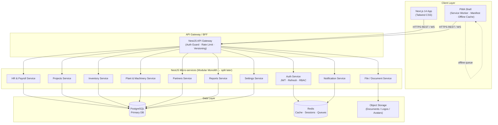

# High-Level Design (HLD) — Construction ERP Platform

> **Stack:** Next.js 14 (App Router) + Tailwind CSS · NestJS · PostgreSQL · Redis  
> **PWA:** Service Worker · Web App Manifest · Offline-first for field users  
> **Date:** 2026-08-20

---

## 1. System Overview

A multi-tenant, multi-company Construction ERP covering HR & Payroll, Plant & Machinery, Project Management, Inventory, Partner compliance, and cross-module Reporting — accessed via a responsive web client, a REST + WebSocket API layer, and a **PWA shell installable on mobile devices** for field workers (site supervisors, operators, attendance marking).

---

## 2. Architecture Diagram



---

## 3. Technology Stack

| Layer | Technology | Rationale |
|---|---|---|
| **Frontend** | Next.js 14 (App Router) | SSR/SSG for fast loads, file-based routing, built-in API routes for BFF patterns |
| **PWA** | `next-pwa` (Workbox) | Service worker, offline caching, installable on Android/iOS home screen |
| **Styling** | Tailwind CSS + shadcn/ui | Utility-first, design-system ready, zero runtime |
| **State** | Zustand + React Query (TanStack) | Server-state caching & optimistic updates |
| **Backend** | NestJS (Node.js) | Opinionated, modular, decorator-driven; maps naturally to ERP modules |
| **ORM** | Prisma | Type-safe queries, migrations, multi-schema support |
| **Auth** | JWT (access) + Refresh token rotation | Stateless, scalable; refresh tokens stored in Redis |
| **Real-time** | Socket.io (via NestJS Gateway) | Live notifications, attendance updates |
| **Background Jobs** | BullMQ on Redis | Payroll runs, report generation, compliance checks |
| **Primary DB** | PostgreSQL 16 | ACID, JSON columns, full-text search, row-level security |
| **Cache / Queue** | Redis 7 | Session store, BullMQ queues, hot-data caching |
| **File Storage** | S3-compatible object store | Documents, logos, salary slips, compliance uploads |
| **Email / SMS** | Resend (email) + Twilio (SMS) | Payslip delivery, OTP, approval alerts |

---

## 4. Module → Service Mapping

### 4.1 Auth Service
- Login / logout, token refresh, password reset
- Role-Based Access Control (RBAC): Super-Admin, HR Manager, Site Supervisor, Employee, Finance, Viewer
- Multi-company context switching (tenant isolation via `company_id` on every row)

### 4.2 HR & Payroll Service
**Submodules:** Employee Master · Attendance · Leave · Payroll Runs · PF/ESIC Challans · Loans  
**Key flows:**
- Attendance ingestion (manual punch / geo-tag / biometric import)
- Monthly payroll run → salary-slip PDF generation (queued job)
- PF / ESIC challan generation
- Loan ledger with deduction scheduling

### 4.3 My Workspace Service *(thin module inside HR)*
- Personal punch, leave apply, salary summary, face-enrolment hook

### 4.4 Projects Service
**Submodules:** Portfolio · Clients · Sites · DWR · P&L · Costing · Bills & Expenses  
**Key flows:**
- Project CRUD with budget vs. actual cost tracking
- Daily Work Reports aggregated into progress %
- Dynamic P&L: Revenue − (Labour + Material + Machinery + Fuel + Other)

### 4.5 Plant & Machinery Service
**Submodules:** Asset Register · Logbook · Fuel Management · Maintenance · Hire Bills · Vehicle Documents  
**Key flows:**
- Asset assignment to project/operator
- Fuel entries → consumption analytics
- Document expiry alerts (Insurance, RC, Permit)

### 4.6 Inventory Service
**Submodules:** Stock Register · Purchases/GRN · Issues · Transfers · Payments · Item Masters  
**Key flows:**
- GRN → stock increase; Issue → stock decrease (FIFO/AVCO costing)
- Multi-site transfer with in-transit state
- Supplier payment settlement ledger

### 4.7 Partners Service
**Submodules:** Vendor Master · Contractor Master · Compliance Submissions · RAG Matrix  
**Key flows:**
- Compliance document uploads with expiry tracking
- Automated RAG score recalculation on upload/expiry

### 4.8 Reports Service
- Cross-module report builder (attendance, payroll, fuel, project cost, P&L)
- Async generation via BullMQ → downloadable CSV / PDF
- Scheduled reports via cron jobs

### 4.9 Notification Service
- In-app notifications via Socket.io
- Email/SMS dispatch (payslip, leave approval, compliance alerts)
- Notification preferences per user

### 4.10 File / Document Service
- Pre-signed upload URLs → direct browser-to-storage upload
- Thumbnail generation for images
- Virus scan hook (ClamAV or cloud scan)

### 4.11 Settings Service
- Company master (multi-entity, GSTIN, PAN, PF/ESIC codes)
- User management & role assignment
- Code series configuration (employee IDs, project codes)

---

## 5. Database Design (High Level)

```
companies          ← top-level tenant
  └─ users         (company_id FK)
  └─ employees     (company_id FK)
      └─ attendance_logs
      └─ leave_requests
      └─ payroll_runs
          └─ salary_slips
  └─ projects      (company_id FK)
      └─ sites
      └─ dwrs
      └─ project_bills
      └─ project_expenses
  └─ assets        (company_id FK) — plant & machinery
      └─ logbook_entries
      └─ fuel_entries
      └─ maintenance_jobs
  └─ inventory_items (company_id FK)
      └─ stock_transactions (purchase | issue | transfer)
  └─ partners      (company_id FK) — vendors & contractors
      └─ compliance_submissions
  └─ notifications (user_id FK)
  └─ documents     (entity_type + entity_id polymorphic)
```

**Multi-tenancy strategy:** Shared schema with `company_id` discriminator on all tables + Postgres Row-Level Security policies. Prisma middleware enforces tenant context on every query.

---

## 6. API Design

- **Convention:** REST with versioning (`/api/v1/...`)
- **Auth:** Bearer JWT on all protected routes
- **Pagination:** Cursor-based for large datasets (attendance, stock logs)
- **Real-time:** WebSocket namespace per module (`/ws/notifications`, `/ws/attendance`)
- **Validation:** class-validator + class-transformer DTOs in NestJS
- **Docs:** Auto-generated Swagger/OpenAPI at `/api/docs`

---

## 7. Hosting Options & Cost Estimate

### Option A — Low Cost (Recommended for MVP / Startup)

| Service | Provider | Plan | Est. Monthly Cost |
|---|---|---|---|
| **Frontend (Next.js)** | **Vercel** | Hobby (1 project free) → Pro $20 | **$0–$20** |
| **Backend (NestJS)** | **Railway** | Starter $5 credit free → ~$10–15 | **$0–$15** |
| **PostgreSQL** | **Supabase** | Free (500 MB) → Pro $25 | **$0–$25** |
| **Redis** | **Upstash** | Free (10K cmd/day) → Pay-per-use | **$0–$5** |
| **Object Storage** | **Cloudflare R2** | Free 10 GB; $0.015/GB after | **$0–$5** |
| **Email** | **Resend** | Free 3K/month → $20/100K | **$0–$20** |
| **SMS (optional)** | **Twilio** | Pay-per-use ~$0.005/SMS | **~$5** |
| **Domain + SSL** | **Cloudflare** | Free SSL; domain ~$10/yr | **~$1** |
| **CI/CD** | **GitHub Actions** | Free (2000 min/month) | **$0** |
| | | **TOTAL MVP** | **~$5–$96/mo** |

> **Start free:** Vercel Hobby + Supabase Free + Upstash Free + Cloudflare R2 = **$0/month** for low-traffic MVP.

---

### Option B — Mid-Tier (Production / Growing Team)

| Service | Provider | Plan | Est. Monthly Cost |
|---|---|---|---|
| **Frontend** | **Vercel Pro** | $20/month | **$20** |
| **Backend** | **Render** | Standard instance ($25) | **$25** |
| **PostgreSQL** | **Neon** (serverless Postgres) | Scale $69 | **$69** |
| **Redis** | **Upstash Redis** | Pro $30 | **$30** |
| **Object Storage** | **AWS S3** | ~50 GB | **~$5** |
| **Email** | **Resend** | $20/100K emails | **$20** |
| **Monitoring** | **BetterStack** (Logtail + Uptime) | Free tier | **$0** |
| | | **TOTAL** | **~$169/mo** |

---

### Option C — Cloud-Native (Scale / Enterprise)

| Service | Provider | Notes | Est. Monthly Cost |
|---|---|---|---|
| **Frontend** | AWS CloudFront + S3 | Static export + CDN | **~$5** |
| **Backend** | AWS ECS Fargate | 0.25 vCPU / 0.5 GB | **~$15** |
| **PostgreSQL** | AWS RDS (t3.micro) | Multi-AZ adds cost | **~$25** |
| **Redis** | AWS ElastiCache (t3.micro) | | **~$25** |
| **Object Storage** | AWS S3 | | **~$5** |
| **Load Balancer** | AWS ALB | | **~$18** |
| **CI/CD** | GitHub Actions + AWS ECR | | **~$5** |
| | | **TOTAL** | **~$98/mo** |

---

## 8. All Services Checklist

| # | Service | Purpose | Low-Cost Pick |
|---|---|---|---|
| 1 | **Frontend Hosting** | Serve Next.js app | Vercel (free) |
| 2 | **Backend Hosting** | Run NestJS API | Railway / Render |
| 3 | **Relational Database** | Core ERP data | Supabase / Neon |
| 4 | **Cache & Queues** | Sessions, BullMQ jobs | Upstash Redis |
| 5 | **Object / File Storage** | Docs, avatars, slips | Cloudflare R2 |
| 6 | **Email Delivery** | Payslips, alerts | Resend |
| 7 | **SMS / OTP** | Approvals, 2FA | Twilio (pay-per-use) |
| 8 | **Authentication** | JWT + RBAC | Built-in NestJS (no extra cost) |
| 9 | **Background Jobs** | Payroll, reports | BullMQ on Upstash Redis |
| 10 | **Real-time / WebSocket** | Notifications, live updates | Socket.io on same NestJS instance |
| 10a | **PWA / Service Worker** | Offline support, installable app shell | `next-pwa` + Workbox (no extra cost) |
| 10b | **Web Push Notifications** | Push alerts on mobile when app is closed | Web Push API + VAPID keys (no extra cost) |
| 11 | **CDN** | Static assets, edge caching | Cloudflare (free) |
| 12 | **DNS & SSL** | Domain routing, HTTPS | Cloudflare (free) |
| 13 | **CI / CD Pipeline** | Auto-deploy on push | GitHub Actions (free) |
| 14 | **Logging & Monitoring** | Error tracking, uptime | BetterStack / Sentry free tier |
| 15 | **PDF Generation** | Salary slips, reports | Puppeteer on backend (no extra cost) |
| 16 | **Search (optional)** | Global search across modules | Postgres full-text (built-in) or Meilisearch free tier |
| 17 | **Backup** | DB snapshots | Supabase / Neon built-in |

---

## 9. Security Considerations

- HTTPS everywhere (Cloudflare TLS termination)
- JWT access tokens (15 min TTL) + HTTP-only cookie refresh tokens (7 days)
- Row-Level Security in Postgres enforces company data isolation
- Input validation via NestJS class-validator on all DTOs
- Rate limiting on Auth endpoints (NestJS throttler)
- Pre-signed S3/R2 URLs — files never proxied through API
- Audit log table for destructive actions (delete, payroll run, role changes)
- Secrets managed via environment variables (never committed)

---

## 10. Scalability Path

```
Phase 1 (MVP)     → Modular Monolith NestJS + Supabase + Vercel  (~$0–$30/mo)
Phase 2 (Growth)  → Extract Reports & Payroll as separate NestJS apps  (~$50–$100/mo)
Phase 3 (Scale)   → Kubernetes on AWS EKS / GKE + read replicas + CDN cache  (~$200+/mo)
```

---

## 11. PWA Design

### 11.1 What Gets Cached (Workbox Strategy)

| Asset / Route | Cache Strategy | Why |
|---|---|---|
| App shell (layout, icons, fonts) | **Cache First** | Instant load, changes rarely |
| Dashboard & module pages | **Stale-While-Revalidate** | Show cached, refresh in background |
| API GET responses (employees, projects list) | **Network First** (5 s timeout → cache) | Fresh when online, usable offline |
| File uploads / POST/PUT/DELETE | **Background Sync queue** | Queue mutations when offline, replay on reconnect |

### 11.2 Offline-First Flows (Field User Priority)

| Feature | Offline Behaviour |
|---|---|
| **Attendance punch** | Saved to IndexedDB queue → synced on reconnect |
| **Daily Work Report (DWR)** | Drafted offline, submitted when back online |
| **Fuel entry** | Queued and synced automatically |
| **Employee list / project list** | Read from cache (last fetched snapshot) |
| **Payroll run / report generation** | Blocked — requires live connection (shown clearly in UI) |

### 11.3 PWA Manifest

```json
{
  "name": "Construction ERP",
  "short_name": "ERP",
  "start_url": "/dashboard",
  "display": "standalone",
  "orientation": "portrait",
  "background_color": "#0f172a",
  "theme_color": "#0f172a",
  "icons": [
    { "src": "/icons/icon-192.png", "sizes": "192x192", "type": "image/png" },
    { "src": "/icons/icon-512.png", "sizes": "512x512", "type": "image/png", "purpose": "maskable" }
  ]
}
```

### 11.4 Push Notifications (Web Push)

- Backend generates **VAPID key pair** once; public key served to client
- On login, browser requests `Notification` permission → subscription stored in DB against `user_id`
- NestJS Notification Service sends push via `web-push` npm package
- Use cases: leave approved/rejected, payroll processed, compliance document expiring, DWR pending
- iOS 16.4+ supports Web Push on home-screen PWA

### 11.5 Mobile UX Adjustments

- Bottom navigation bar replaces sidebar on `< md` breakpoints
- Touch-friendly tap targets (min 44 × 44 px)
- Camera access for face enrolment and document upload (via `<input capture>`)
- Geo-location for attendance punch (`navigator.geolocation`)
- "Add to Home Screen" banner shown to field users on first login

---

## 12. Frontend Folder Structure (Next.js)

```
app/
  (auth)/login/
  (erp)/
    dashboard/
    hr/
      employees/
      attendance/
      leave/
      payroll/
    projects/
    plant/
    inventory/
    partners/
    reports/
    settings/
  layout.tsx          ← sidebar + header shell (desktop)
  mobile-layout.tsx   ← bottom-nav shell (mobile / PWA)
components/
  ui/                 ← shadcn/ui primitives
  modules/            ← module-specific components
lib/
  api/                ← axios/fetch wrappers per service
  hooks/              ← React Query hooks
  store/              ← Zustand slices
  offline/
    syncQueue.ts      ← IndexedDB queue for offline mutations
    backgroundSync.ts ← Service worker sync registration
public/
  manifest.json
  icons/              ← PWA icons (192, 512, maskable)
service-worker/
  sw.ts               ← Workbox config (compiled by next-pwa)
```

## 13. Backend Folder Structure (NestJS)

```
src/
  auth/
  hr/
    employees/
    attendance/
    leave/
    payroll/
  projects/
  plant/
  inventory/
  partners/
  reports/
  notifications/
  files/
  settings/
  common/
    guards/         ← JWT, Roles
    interceptors/   ← logging, transform
    pipes/          ← validation
    decorators/     ← @CurrentUser, @Roles
  prisma/           ← Prisma service + schema
  queue/            ← BullMQ processors
main.ts
```
